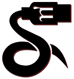

---

#  UOS Python Interface

Python Interface for remote communication and control of a UOS Compliant Microcontroller.

**[Documentation](https://uos-interface.nulltek.xyz)**

**[Source Code](https://github.com/CreatingNull/UOS-Interface)**
